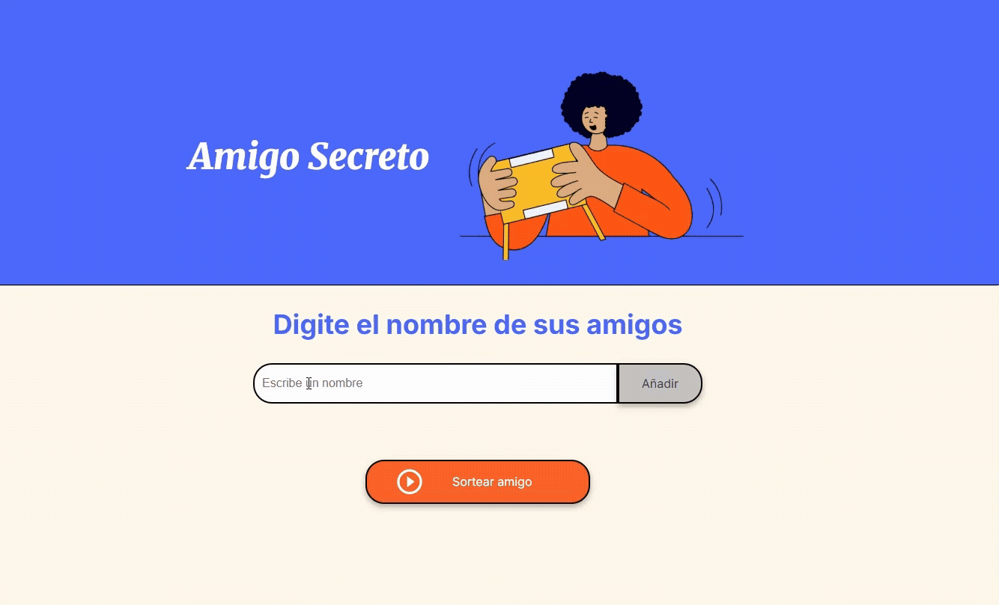

# Amigo Secreto


> *Aplicación web sencilla para organizar un sorteo de Amigo Secreto usando JavaScript y manipulación del DOM.*

---

## Insignias


---

<details>
  <summary>📑 Índice</summary>

1. [Descripción del Proyecto](#-descripción-del-proyecto)  
2. [Estado del Proyecto](#-estado-del-proyecto)  
3. [Demostración de Funciones y Aplicaciones](#-demostración-de-funciones-y-aplicaciones)  
4. [Acceso al Proyecto](#-acceso-al-proyecto)  
5. [Tecnologías utilizadas](#-tecnologías-utilizadas)  
6. [Personas Contribuyentes](#-personas-contribuyentes)  
7. [Personas Desarrolladoras del Proyecto](#-personas-desarrolladoras-del-proyecto)  
8. [Licencia](#-licencia)  

</details>

---

## Descripción del Proyecto

Este proyecto implementa un **sorteo de Amigo Secreto** en el que los usuarios pueden:  

- Ingresar nombres en una lista.  
- Validar entradas para evitar valores vacíos o repetidos.  
- Mostrar dinámicamente la lista en pantalla.  
- Realizar un sorteo aleatorio entre los participantes.  
- Posibilidad de agregar de nuevo más nombres para seguir jugando.  

El principal objetivo es **practicar lógica de programación, validaciones y manipulación del DOM en JavaScript puro**.

---

## Estado del Proyecto

**Finalizado**  
Es funcional pero pueden añadirse mejoras como:  
- Permitir múltiples sorteos sin reinicio.  
- Mejorar la interfaz con CSS.

---

## Demostración de Funciones y Aplicaciones

1. El usuario agrega nombres.
2. La lista se muestra en pantalla.  
3. Al presionar **Sortear Amigo Secreto**, se realiza un sorteo aleatorio de todos los amigos y se muestra al "Amigo Secreto".
4. La lista se limpia automáticamente para reiniciar el juego.

<p align="center">
  
</p>

---

## Acceso al Proyecto

1. Clonar el repositorio:

```bash
git clone https://github.com/usuario/amigo-secreto.git
```
2. Abre index.html en tu navegador y listo, ¡Puedes jugar **"Amigo Secreto"**!.
